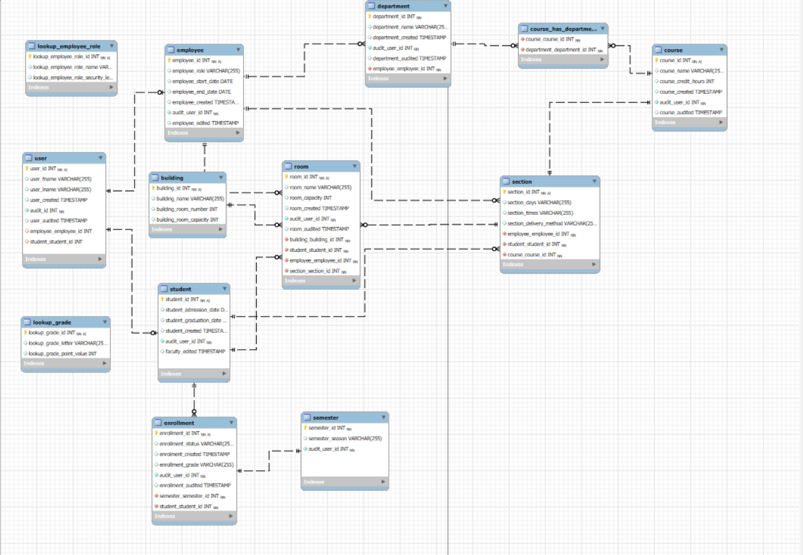
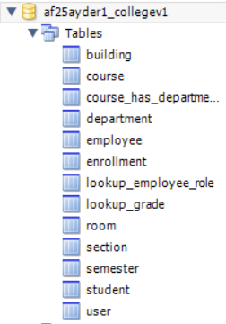

# 📚 Student Information System Database

A relational Student Information System (SIS) database designed for Students, Faculty, and Admins to manage grades, enrollment, courses, rooms, and departments.  
[](#)
[](#)

## Table of Contents

- [Role Features](#role-features)
  - [Students](#students)
  - [Faculty](#faculty)
- [Entity–Relationship Model](#entity–relationship-model)
  - [Diagram](#diagram)
  - [Key Tables](#key-tables)
- [Views](#views)
- [Tech Stack](#tech-stack)
- [Setup](#setup)
- [Authors](#authors)

## Role Features

### Students

View grades and enrollment status.

Access course and section details they are linked to.

### Faculty

View and update grades for students they teach.

Manage sections they are assigned to.

View departmental and course relationships.

## Entity–Relationship Model

The schema enforces role-based access, integrity, and scalability.

### Diagram

Below are the exported diagrams from MySQL Workbench. Click the images to view the full-size versions.

[](assets/EER_Diagram.png)  
*EER Diagram — shows tables and relationships.*

[](assets/Catalog_Tree.png)  
*Catalog Tree — shows the list of tables in the generated schema.*

## Views

The database includes several custom **SQL views** to simplify querying and reporting across core entities like students, instructors, courses, and academic performance. These views were created to answer common questions and support administrative tasks.

### Implemented Views

| View Name | Description |
|------------|-------------|
| `vw_enrollment_details` | Displays each student’s enrollment information, including semester, grade, and status. |
| `vw_course_schedule` | Lists course sections with instructor, room, and building details for scheduling. |
| `vw_student_enrollment_summary` | Summarizes each student’s total, active, and completed enrollments, plus GPA. |
| `vw_department_course_counts` | Shows department heads, total courses offered, and course listings. |
| `sections_with_rooms_view` | Displays which instructors are teaching which courses, in which rooms, and at what times. |
| `graduated_students_high_gpa_view` | Lists all students who have graduated with a GPA above 3.5, including admission and graduation dates. |
| `instructor_by_role_view` | Shows employees with their assigned roles, titles, and personal details. |
| `semesters_by_student_view` | Lists all semesters each student has been enrolled in, including status (Active, Completed, Withdrawn). |

> These views were built using `JOIN`, `GROUP BY`, `HAVING`, and `ORDER BY` clauses, and tested on sample data generated using `INSERT` statements.  
> They are reusable across reporting tools or integrations with front-end dashboards.

## Key Tables

- `user` – Authentication & link to student / employee.
- `student` – Admissions, graduation, enrollment link.
- `employee` – Faculty/Admin records with roles.
- `department` – Academic departments.
- `course` – Courses with credit hours.
- `section` – Course offerings, linked to faculty/students.
- `enrollment` – Tracks student enrollment status.
- `semester` – Current and archived academic terms.
- `room` / `building` – Physical classroom resources.
- Lookups – Employee roles, grades.

## Tech Stack

- Database: MySQL / MariaDB  
- Modeling: MySQL Workbench (Forward Engineering)

## Setup

Clone the repository:

Powershell
```
git clone https://github.com/TylerLucas1/CollegeV2.git
cd CollegeV3
```
Import the .sql schema into MySQL Workbench.

Run the script to create tables and relationships.


## Authors

[Nathan Mulholland](https://github.com/Beast1692)
[Tyler Lucas](https://github.com/TylerLucas1)
